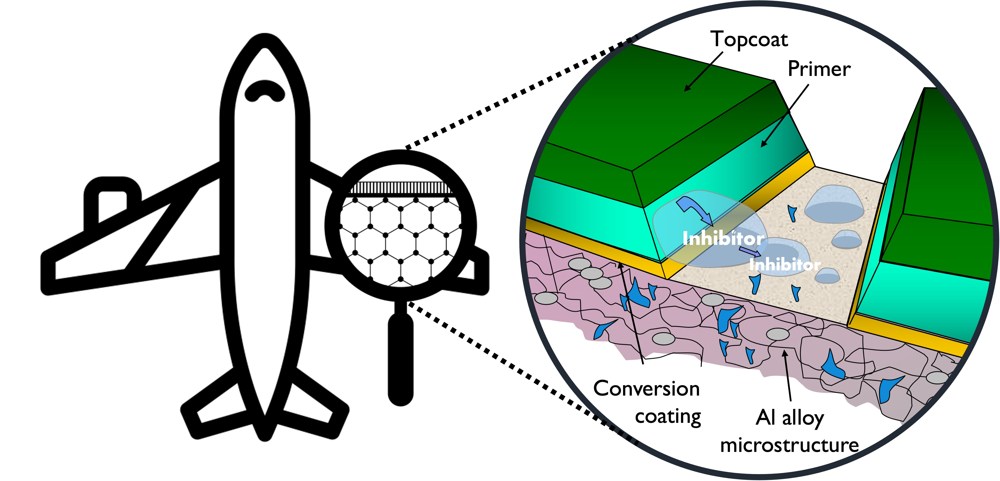

AETOC workshop deals with all the topics related to recent developments in the application of electrochemical techniques to the study and monitoring of organic coatings, as well as novel hybrid (i/o) sol-gel and composite coatings with self-healing and protective properties.

  

Topics of particular interest include:

* Electrochemical studies of organic coatings;
* Electrochemical studies of hybrid (i/o) sol-gel and composite coatings
* Electrochemical studies of surface conversion layers to improve paint adhesion and durability
*  Electrochemical characterisation of smart organic layers
*  Electrochemical techniques to assess the properties of green and sustainable materials for novel organic coatings;
*  Service life assessments thorough electrochemical methods;
*  Combination of electrochemical techniques to study corrosion inhibitors for paints;
*  Novel electrochemical methods to study sol-gel based and organic coatings;
*  Electrochemical sensors to monitor organic coatings degradation;
*  Modelling of electrochemical properties of organic coatings.
