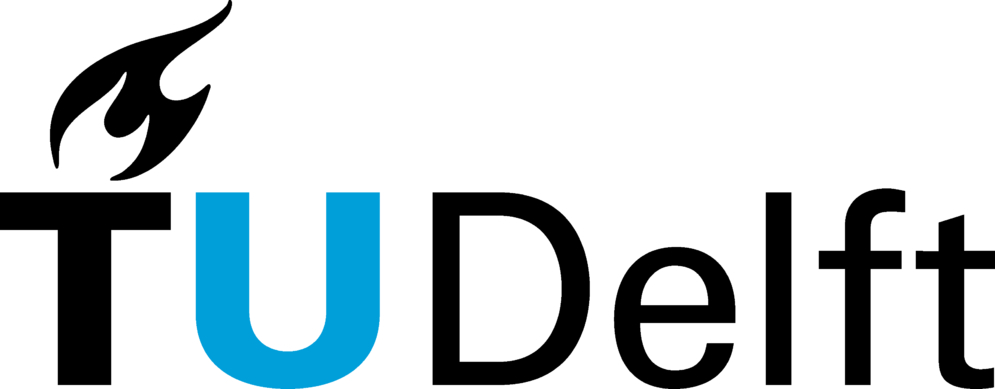
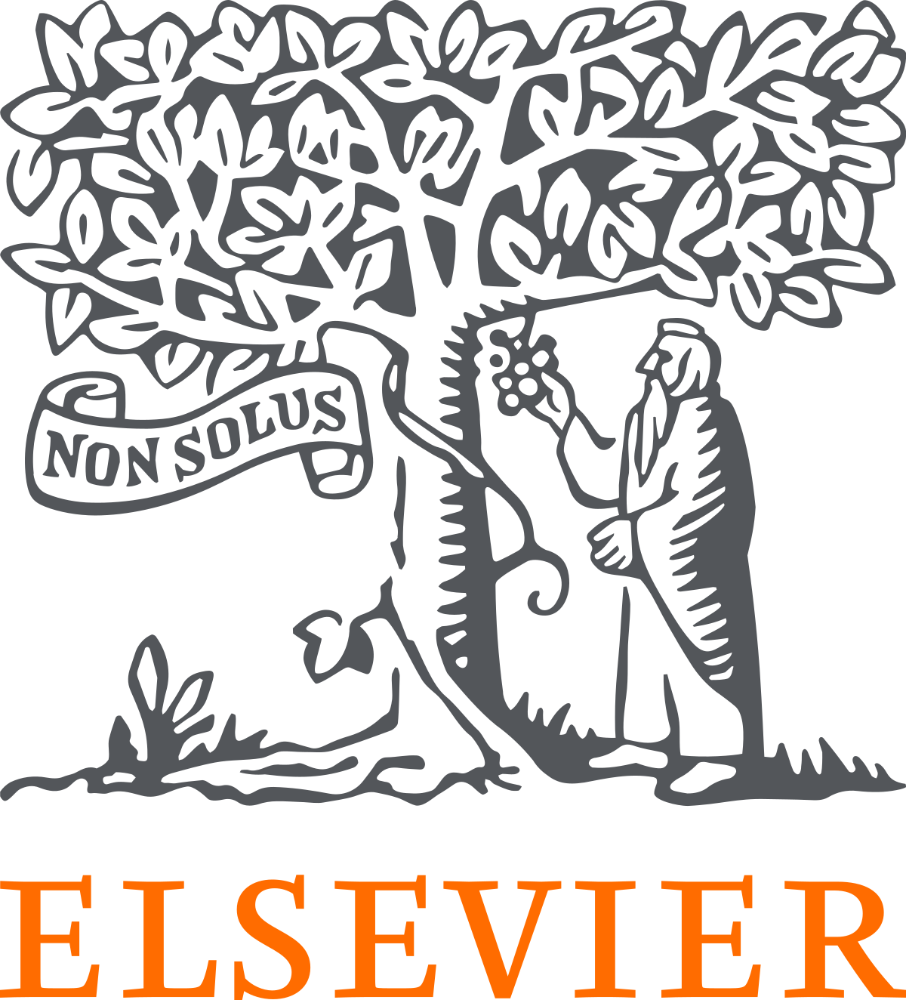

# Call for Abstracts
Abstracts should be **sent** by email to [aetoc2024@tudelft.nl](mailto:aetoc2024@tudelft.nl) by **Feb. 16, 2024**.

**Acceptance notification** will be communicated within **Mar. 8, 2024**.

<blockquote style="color: gray;">Contact us if the deadlines are too tight or you or if you want to attend without presenting.</blockquote>

We kindly request to use only the abstract template available below.

✏️ [Abstract template](./Abstract_Template_AETOC2024.docx){:target="_blank"} (DOCX) 

> Thanks to the kind support of the Editorial Board, all communications presented at the meeting will have the opportunity of submitting to a special issue of [Progress in Organic Coatings](https://www.sciencedirect.com/journal/progress-in-organic-coatings){:target="_blank"}.

# Attendance and Deadlines
### Registration fees
**995,00€** (VAT included)

AETOC 2024 has reserved a limited number of rooms at the workshop venue hotel [Strandhotel Golfzang](https://www.golfzang.nl/nl/){:target="_blank"}. We highly recommend that you register at your earliest convenience to secure a room.

**The registration form will be online from 16 February.**

<a href="https://www.aanmelder.nl/en/" target="_blank" style="background-color: #4AA3D2; color: white; padding: 10px 20px; text-decoration: none; border-radius: 5px;">Registration</a>

The registration fee includes:

* 3-nights accommodation at Strandhotel Golfzang, from 28 to 31 May   
* Lunches on 29, 30, 31 May  
* Dinners on 28 and 29 May  
* Gala Dinner on 30 May  
* Coffee breaks  
* Social activities  
* Collection of Abstracts  
* Participant kit  

Accompanying person: please be aware that in the registration form will not be possible to add any accompanying persons. Upon registration, please contact directly the hotel. The Delft University of Technology is not allowed to manage the payment of the accompanying person.

### Please take due notice of the following deadlines:  

Abstract Submission:  16 Feb. 2024  
Abstract Acceptance Notification: 8 Mar. 2024  
Registration: 16 Feb. 2023 - 31 Mar. 2024  
Publication of Final Program: 15 Apr. 2024

Kindly notice: no onsite registration or payment will be accepted.   

  
  &nbsp; &nbsp; &nbsp; &nbsp;
  

